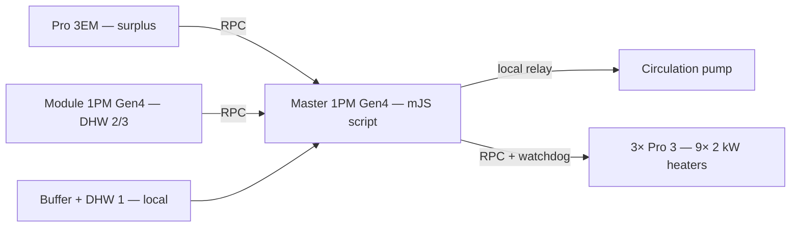

# Shelly PV Power-to-Heat Controller

> Divert surplus photovoltaic power into a heat buffer and DHW cylinders — entirely on Shelly hardware. No cloud, no Home Assistant, no Modbus bridge.

**Languages:** English · [Polski](README.pl.md)

A Shelly mJS script that does two things on a single controller:

1. **Heats from PV surplus** — switches electric heater stages so the load consumes only the solar power that would otherwise be exported to the grid, measured natively by a Shelly Pro 3EM. It never draws from the grid.
2. **Runs a differential circulation pump** — moves heat from a buffer tank to DHW cylinders based on a temperature differential with hysteresis.

All logic runs locally as a script on a Shelly 1PM Gen4 — no internet dependency, no cloud scenes.

---

## Features

- **Dynamic PV-surplus heating** — adds heater stages one at a time when there is spare export, and sheds them immediately on grid import. Because each 2 kW stage lowers export by 2 kW (seen in the next reading), the loop self-regulates and never imports.
- **Differential pump control** — compares the buffer against the *coldest* DHW cylinder; ON at ≥ 10 °C difference, OFF below 6 °C (configurable), plus an anti-scald DHW limit.
- **Fully local** — mJS script on the device; no cloud scenes, no Modbus, no Home Assistant.
- **Safety layers** — buffer over-temperature cutoff, per-stage heater watchdog (auto-off), measurement fail-safe (heaters off if the meter can't be read), and a DS18B20 `85 °C` error filter with last-good hold.
- **Flexible sensor layout** — one `SENSORS` block declares, per sensor, which device it lives on and its component id; rebalance across devices by flipping a flag.

---

## Hardware (BOM)

| Device | Role | Notes |
|---|---|---|
| Shelly 1PM Gen4 + Plus Add-on | **Master** — script, pump relay, local sensors | Add-on: 2× DS18B20 (buffer + DHW 1) |
| Shelly 1PM Gen4 + Plus Add-on | **Measurement module** — DHW temperatures only | Add-on: 2× DS18B20 (DHW 2 + DHW 3) |
| Shelly Pro 3EM | Grid/surplus meter | 3× CT at the main incomer |
| Shelly Pro 3 ×3 | Heater stages | 9 × 2 kW (contacts 1/2/3 = stage 1/2/3) |
| DS18B20 ×4 | Temperatures | buffer + 3× DHW |

> **Note on Add-on sensor count:** keep **max 3 DS18B20 per Add-on**. Four on one Add-on proved unstable (spurious `85 °C`). Splitting 2 + 2 across two devices is well within the limit.

---

## How it works



Every 30 s the master reads all temperatures (buffer + DHW 1 locally, DHW 2/3 from the module over RPC) and the grid power from the Pro 3EM, then:

- **Pump:** if `buffer − coldest_DHW ≥ 10 °C` → ON; below 6 °C → OFF. Forced OFF if any DHW reaches the anti-scald limit.
- **Heaters:** if export ≥ one stage + margin → add a stage; if importing → shed enough stages to stop importing. Buffer over-temperature has absolute priority (all heaters off).

---

## Wiring (DS18B20)

- **Daisy-chain**, not a star — all sensors on one linear bus per Add-on.
- **One pull-up resistor** on the data line: 4.7 kΩ (drop to 3.3 kΩ for longer/multi-sensor runs), close to the Add-on. The Add-on's built-in 10 kΩ (VREF+R1) output is for analog dividers and is too weak here.
- **Max 3 sensors per Add-on** (VCC output is limited to 10 mA).
- Adequate cable cross-section, away from power wiring.

A reference wiring diagram is in [`docs/`](docs/).

---

## Installation

1. **Firmware & network** — update all Shelly devices; assign static IPs (DHCP reservations) to the module, the Pro 3EM and the three Pro 3.
2. **Sensors** — wire each Add-on (chain + one pull-up), then *Peripherals → Temperature (DS18B20) → Rescan*.
3. **Identify sensors by id** — newer firmware does not expose the 1-Wire address, so sensors are referenced by component **id** (ids start at 100 **per device**). Warm a sensor by hand and see which id's `tC` rises:
   ```bash
   curl "http://<device-ip>/rpc/Temperature.GetStatus?id=100"
   ```
4. **Configure** — fill in `CFG` (IPs, `EXPORT_SIGN`, `BUFFER_MAX`, `CWU_MAX`) and the `SENSORS` block (`local` + `id` per sensor).
5. **Upload** — on the master (1PM Gen4): *Scripts → Add script*, paste `src/control.js`, **Save → Start**, enable **Run on startup**.
6. **Commission** — verify pump ON/OFF, heater staging up/down, buffer cutoff, watchdog, and meter fail-safe.

---

## Configuration reference

| Key | Meaning |
|---|---|
| `EM_IP`, `TEMPDEV_IP`, `HEATER1..3_IP` | device IP addresses |
| `STEP_W`, `POWER_MARGIN` | heater stage power and safety margin (W) |
| `EXPORT_SIGN` | set so surplus (export) reads positive (`-1` or `+1`) |
| `BUFFER_MAX`, `BUFFER_HYST` | buffer over-temperature cutoff + hysteresis (°C) |
| `PUMP_ON_DIFF`, `PUMP_OFF_DIFF` | pump differential thresholds (°C) |
| `CWU_MAX` | anti-scald DHW limit (°C; `0` = off) |
| `AUTO_OFF_S` | heater watchdog auto-off delay (s) |
| `POLL_MS` | control loop period (ms) |
| `SENSORS[]` | per sensor: `local` (master vs module) and `id` |

---

## Repository layout

```
shelly-pv-heat/
├── README.md            (this file, English)
├── README.pl.md         (Polish)
├── src/
│   └── control.js       (the mJS control script)
├── docs/
│   ├── deployment.html  (commissioning guide)
│   └── deployment_pl.html
```

---

## Safety & disclaimer

This project controls mains-powered heating equipment. Installation and wiring must be done by a qualified person in line with local regulations. The buffer over-temperature cutoff and pump anti-scald limit are software safeguards and **do not replace** hardware thermal protection (thermostats / STB) required by the installation. Provided as-is, without warranty; use at your own risk. Not an official Shelly / Allterco product — adjust affiliation wording to your context.

## License

Suggested: MIT (add a `LICENSE` file). Change to suit.
