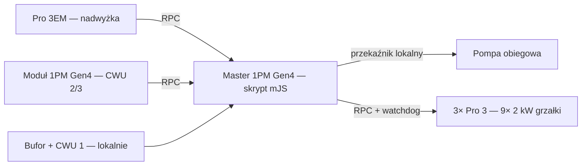

# Sterownik power-to-heat na Shelly

> Zagospodarowuje nadwyżkę fotowoltaiki na grzanie bufora i zasobników CWU — w całości na sprzęcie Shelly. Bez chmury, bez Home Assistanta, bez mostka Modbus.

**Języki:** [English](README.md) · Polski

Skrypt Shelly (mJS) realizujący dwie funkcje na jednym sterowniku:

1. **Grzanie z nadwyżki PV** — załącza stopnie grzałek tak, żeby układ zużywał tylko tę energię słoneczną, która i tak popłynęłaby do sieci (pomiar natywnie z Shelly Pro 3EM). Nigdy nie pobiera z sieci.
2. **Pompa obiegowa na różnicówce** — przepompowuje ciepło z bufora do zasobników CWU w oparciu o różnicę temperatur z histerezą.

Cała logika działa lokalnie jako skrypt na Shelly 1PM Gen4 — bez zależności od internetu i scen w chmurze.

---

## Funkcje

- **Dynamiczne grzanie z nadwyżki PV** — dokłada stopnie po jednym, gdy jest zapas eksportu, i natychmiast je zdejmuje przy poborze z sieci. Każdy stopień 2 kW obniża eksport o 2 kW (widać to w kolejnym pomiarze), więc układ sam się reguluje i nie pobiera z sieci.
- **Różnicówka pompy** — porównuje bufor z **najzimniejszym** zasobnikiem CWU; ON przy różnicy ≥ 10 °C, OFF poniżej 6 °C (konfigurowalne), plus limit anty-oparzeniowy CWU.
- **W pełni lokalnie** — skrypt mJS na urządzeniu; bez scen w chmurze, bez Modbusa, bez HA.
- **Warstwy bezpieczeństwa** — limit temperatury bufora, watchdog grzałek (auto-off), fail-safe pomiaru (grzałki OFF przy braku odczytu licznika) oraz filtr błędu `85 °C` DS18B20 z podtrzymaniem ostatniej dobrej wartości.
- **Elastyczne rozmieszczenie czujników** — jeden blok `SENSORS` określa dla każdego czujnika, na którym urządzeniu siedzi i jakie ma id; podział zmienia się przełączeniem flagi.

---

## Sprzęt (BOM)

| Urządzenie | Rola | Uwagi |
|---|---|---|
| Shelly 1PM Gen4 + Plus Add-on | **Master** — skrypt, pompa, czujniki lokalne | Add-on: 2× DS18B20 (bufor + CWU 1) |
| Shelly 1PM Gen4 + Plus Add-on | **Moduł pomiarowy** — tylko temperatury CWU | Add-on: 2× DS18B20 (CWU 2 + CWU 3) |
| Shelly Pro 3EM | Pomiar nadwyżki na złączu z siecią | 3× przekładnik CT na głównym obwodzie |
| Shelly Pro 3 ×3 | Stopnie grzałek | 9 × 2 kW (styk 1/2/3 = stopień 1/2/3) |
| DS18B20 ×4 | Temperatury | bufor + 3× CWU |

> **Uwaga o liczbie czujników:** maks. **3 DS18B20 na jeden Add-on**. Cztery na jednym okazały się niestabilne (błędne `85 °C`). Podział 2 + 2 na dwa urządzenia jest z zapasem.

---

## Jak to działa



Co 30 s master odczytuje temperatury (bufor + CWU 1 lokalnie, CWU 2/3 z modułu po RPC) oraz moc na złączu z Pro 3EM, po czym:

- **Pompa:** jeśli `bufor − najzimniejsze CWU ≥ 10 °C` → ON; poniżej 6 °C → OFF. Wymuszone OFF, gdy dowolne CWU osiągnie limit anty-oparzeniowy.
- **Grzałki:** jeśli eksport ≥ jeden stopień + margines → dołóż stopień; przy poborze → zdejmij tyle, by nie pobierać z sieci. Przekroczenie limitu bufora ma bezwzględny priorytet (wszystkie grzałki OFF).

---

## Podłączenie czujników (DS18B20)

- **Łańcuch**, nie gwiazda — wszystkie czujniki na jednej magistrali liniowej na Add-on.
- **Jeden rezystor pull-up** na linii DATA: 4,7 kΩ (przy dłuższych/wieloczujnikowych odcinkach 3,3 kΩ), blisko Add-ona. Wbudowane 10 kΩ (VREF+R1) jest do dzielników analogowych i jest tu za słabe.
- **Maks. 3 czujniki na Add-on** (wyjście VCC ograniczone do 10 mA).
- Kabel o odpowiednim przekroju, z dala od instalacji siłowej.

Poglądowy schemat podłączenia jest w [`docs/`](docs/).

---

## Instalacja

1. **Firmware i sieć** — zaktualizuj wszystkie urządzenia; nadaj stałe IP (rezerwacje DHCP) modułowi, Pro 3EM i trzem Pro 3.
2. **Czujniki** — okabluj każdy Add-on (łańcuch + jeden pull-up), następnie *Peripherals → Temperature (DS18B20) → Rescan*.
3. **Identyfikacja po id** — nowszy firmware nie udostępnia adresu 1-Wire, więc czujniki adresuje się po **id** komponentu (id lecą od 100 **osobno na każdym urządzeniu**). Podgrzej czujnik dłonią i sprawdź, przy którym id rośnie `tC`:
   ```bash
   curl "http://<ip-urzadzenia>/rpc/Temperature.GetStatus?id=100"
   ```
4. **Konfiguracja** — uzupełnij `CFG` (IP, `EXPORT_SIGN`, `BUFFER_MAX`, `CWU_MAX`) oraz blok `SENSORS` (`local` + `id` dla każdego czujnika).
5. **Wgranie** — na masterze (1PM Gen4): *Scripts → Add script*, wklej `src/control.js`, **Save → Start**, włącz **Run on startup**.
6. **Testy odbiorowe** — sprawdź pompę ON/OFF, dokładanie i zdejmowanie stopni, limit bufora, watchdog i fail-safe licznika.

---

## Konfiguracja — opis pól

| Klucz | Znaczenie |
|---|---|
| `EM_IP`, `TEMPDEV_IP`, `HEATER1..3_IP` | adresy IP urządzeń |
| `STEP_W`, `POWER_MARGIN` | moc stopnia i margines bezpieczeństwa (W) |
| `EXPORT_SIGN` | ustaw tak, by nadwyżka (eksport) była dodatnia (`-1` lub `+1`) |
| `BUFFER_MAX`, `BUFFER_HYST` | limit temperatury bufora + histereza (°C) |
| `PUMP_ON_DIFF`, `PUMP_OFF_DIFF` | progi różnicówki pompy (°C) |
| `CWU_MAX` | limit anty-oparzeniowy CWU (°C; `0` = wył.) |
| `AUTO_OFF_S` | opóźnienie auto-off watchdoga grzałek (s) |
| `POLL_MS` | okres pętli sterowania (ms) |
| `SENSORS[]` | per czujnik: `local` (master/moduł) i `id` |

---

## Struktura repozytorium

```
shelly-pv-heat/
├── README.md            (angielski)
├── README.pl.md         (ten plik, polski)
├── src/
│   └── control.js       (skrypt sterujący mJS)
├── docs/
│   ├── deployment.html  (instrukcja wdrożeniowa)
│   └── deployment_pl.html
```

---

## Bezpieczeństwo i zastrzeżenia

Projekt steruje urządzeniami grzewczymi zasilanymi z sieci. Montaż i okablowanie musi wykonać osoba z odpowiednimi uprawnieniami, zgodnie z lokalnymi przepisami. Limit temperatury bufora i limit anty-oparzeniowy pompy to zabezpieczenia programowe i **nie zastępują** sprzętowej ochrony termicznej (termostaty / ogranicznik STB) wymaganej w instalacji. Udostępniane „tak jak jest", bez gwarancji; używasz na własną odpowiedzialność. To nie jest oficjalny produkt Shelly / Allterco — dostosuj informację o powiązaniu do swojego kontekstu.

## Licencja

Sugerowana: MIT (dodaj plik `LICENSE`). Zmień wedle uznania.
